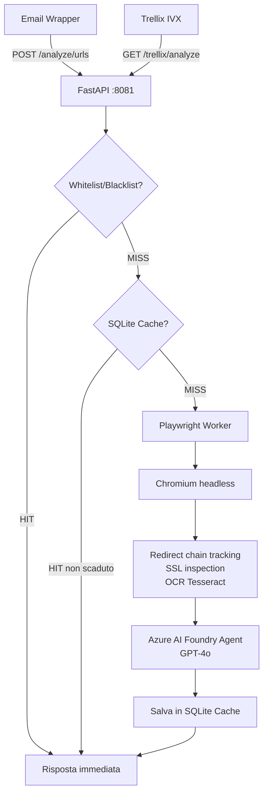
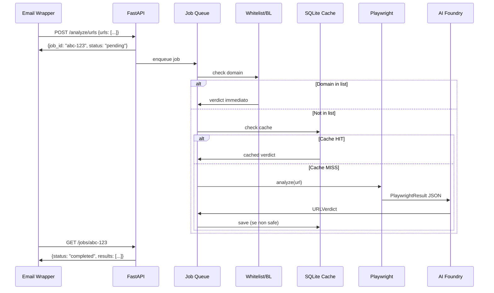
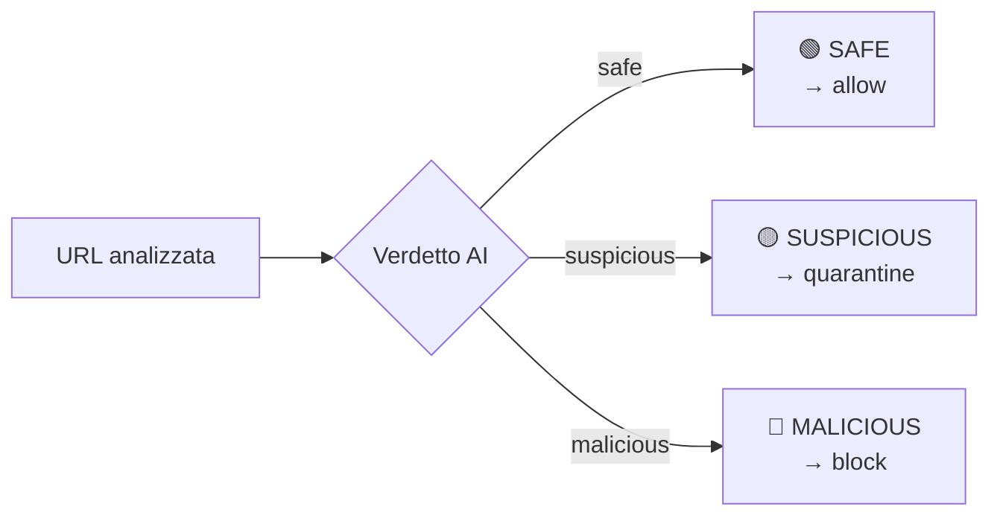

---
tags:
  - security
  - email-security
  - phishing
  - python
  - azure
  - trellix
created: 2026-06-23
project: IntelIVX
status: active
repo: https://github.com/AxelSecurity/IntelIVX
---

# IntelIVX — URL Analyzer

Servizio di analisi URL per pipeline di email security. Riceve URL estratti da email, li analizza tramite browser reale e AI, e restituisce un verdetto strutturato per bloccare, mettere in quarantena o consentire il traffico.

---

## Indice

- [[#Panoramica del progetto]]
- [[#Architettura]]
- [[#Flusso di analisi]]
- [[#Segnali di sicurezza rilevati]]
- [[#Sistema di verdetti]]
- [[#SQLite Verdict Cache]]
- [[#Whitelist e Blacklist]]
- [[#Integrazione Trellix IVX]]
- [[#Azure AI Foundry Agent]]
- [[#IOC Feed]]
- [[#API Reference]]
- [[#Configurazione e deployment]]
- [[#Decisioni architetturali]]
- [[#Problemi noti e soluzioni]]
- [[#Sviluppi futuri]]

---

## Panoramica del progetto

> [!INFO] Contesto
> Il servizio è un componente di una pipeline di email security. Un **wrapper** estrae gli URL dalle email in arrivo e li invia a questo servizio per l'analisi. I risultati determinano se l'email contiene link malevoli.

**Stack tecnologico:**
- Python 3.10 + FastAPI + asyncio
- Playwright 1.60 (Chromium headless)
- Tesseract OCR
- Azure AI Foundry Agent (GPT-4o)
- SQLite (aiosqlite)
- Docker (`mcr.microsoft.com/playwright/python:v1.60.0-jammy`)

**Repository:** https://github.com/AxelSecurity/IntelIVX
**Porta:** 8081
**Swagger UI:** http://localhost:8081/docs

---

## Architettura



### Struttura file progetto

```
url_analyzer/
├── config.py                  # Settings da .env (pydantic-settings)
├── main.py                    # FastAPI app + tutti gli endpoint
├── models/
│   ├── job.py                 # PlaywrightResult, URLVerdict, SSLInfo
│   ├── requests.py            # URLAnalysisRequest, ListEntryRequest
│   └── responses.py           # TrellixAnalysisResponse, TrellixResult
├── services/
│   ├── playwright_service.py  # Browser automation + OCR
│   ├── openai_service.py      # Azure AI Foundry agent client
│   ├── job_service.py         # Job creation/retrieval/queue
│   └── list_service.py        # Whitelist/Blacklist CRUD
├── storage/
│   ├── job_store.py           # In-memory job store con TTL
│   └── verdict_cache.py       # SQLite verdict cache (aiosqlite)
└── workers/
    └── analyzer.py            # Worker loop + funzioni di analisi
```

**Dati runtime (non in git):**
- `lists.json` — whitelist/blacklist
- `data/verdict_cache.db` — SQLite cache (volume Docker: `./data:/app/data`)

---

## Flusso di analisi

### Endpoint asincrono (`/analyze/urls`) — per il wrapper email



### Endpoint sincrono (`/trellix/analyze`) — per Trellix IVX

Stesso flusso ma usa `_analyze_simple()` (1 Playwright + 1 AI call) invece di `_analyze_with_chain()` per rispettare il timeout di 55 secondi di Trellix.

---

## Segnali di sicurezza rilevati

### Playwright estrae 11 segnali

| Segnale | Campo | Descrizione |
|---|---|---|
| Catena redirect | `redirect_chain` | HTTP 3xx, meta-refresh, JS setTimeout |
| Titolo pagina | `page_title` | HTML `<title>` della pagina finale |
| Login form | `has_login_form` | Presenza `<form>` |
| Password field | `has_password_field` | Presenza `<input type="password">` |
| File download | `has_file_download` | Link a .exe, .zip, .msi, .dmg |
| Script esterni | `external_scripts` | Script da domini diversi dall'origine |
| Keyword sospette | `suspicious_keywords` | Frasi phishing nel body text |
| SSL/TLS | `ssl_info` | Emittente, scadenza, self-signed, recente |
| HTTP plain | `ssl_info.is_http` | URL finale su HTTP senza HTTPS |
| OCR screenshot | `ocr_detected_text` | Testo estratto da immagini/loghi |
| Tempo caricamento | `load_time_ms` | Millisecondi |

### Keyword sospette monitorate

```
"verify your account", "confirm your identity", "update your payment",
"your account has been", "click here to unsubscribe", "enter your password",
"sign in to continue", "limited time offer", "act now", "urgent"
```

### Segnali SSL come indicatori di phishing

| Segnale | Rischio | Impatto |
|---|---|---|
| `is_http=true` + login form | 🔴 CRITICO | → MALICIOUS |
| Certificato emesso < 30gg + form | 🔴 ALTO | → MALICIOUS |
| `is_self_signed=true` + credenziali | 🟡 MEDIO | → SUSPICIOUS |
| Certificato scaduto | 🟡 MEDIO | → SUSPICIOUS |
| Scadenza imminente (0-7gg) | 🟡 BASSO | → SUSPICIOUS |
| Let's Encrypt da solo | ⚪ NEUTRO | Nessun impatto |

### OCR per brand impersonation visiva

> [!WARNING] Gap rilevato
> Email di phishing con tema università (es. "La Sapienza") contenevano solo un'immagine con il logo — nessun testo HTML. Il sistema classificava come SAFE. L'OCR risolve questo problema estraendo il testo dai loghi.

**Come funziona:**
1. Screenshot del viewport renderizzato da Playwright
2. Tesseract OCR estrae il testo (lingue: `ita+eng`)
3. Il testo OCR viene incluso nel payload all'agente AI
4. L'AI può rilevare: `ocr_detected_text="Sapienza Università Roma"` + dominio sbagliato → MALICIOUS

---

## Sistema di verdetti

### Classificazione a tre livelli



**MALICIOUS** → `recommended_action: block`
- Brand impersonation + dominio sbagliato
- Login/password form su dominio non ufficiale
- Redirect da sito non correlato a pagina di credential harvesting
- Login form su HTTP (`ssl_info.is_http=true`)
- Certificato recente + login form + dominio sbagliato

**SUSPICIOUS** → `recommended_action: quarantine`
- Redirect verso domini non correlati senza brand impersonation specifica
- Login form su dominio insolito senza brand riconoscibile
- Pagina nascosta da Cloudflare challenge
- Certificato scaduto o in scadenza imminente

**SAFE** → `recommended_action: allow`
- Nessun indicatore di rischio significativo

### Struttura URLVerdict (risposta completa)

```json
{
  "url": "https://original-url.com",
  "verdict": "malicious",
  "confidence": 0.99,
  "risk_indicators": [
    "Page title impersonates PayPal",
    "Login form on mismatched domain"
  ],
  "reason": "Spiegazione dettagliata...",
  "recommended_action": "block",
  "ssl_info": {
    "is_http": false,
    "protocol": "TLS 1.3",
    "issuer": "Let's Encrypt",
    "days_until_expiry": 12,
    "recently_issued": true,
    "is_self_signed": false
  },
  "chain_verdicts": [
    { "url": "https://hop1.com", "verdict": "suspicious", "..." }
  ]
}
```

---

## SQLite Verdict Cache

### Scopo

Evitare di ri-analizzare URL già visti. Per URL con verdetto noto, la risposta è immediata senza chiamate a Playwright o all'agente AI.

### TTL per tipo di verdetto

| Verdict | Cachato? | TTL | Motivazione |
|---|---|---|---|
| `malicious` | ✅ Sì | 30 giorni | Dominio phishing rimane attivo a lungo |
| `suspicious` | ✅ Sì | 3 giorni | Potrebbe evolvere, rivaluta spesso |
| `safe` | ❌ No | — | Sempre ri-analizzato per cogliere compromissioni future |

> [!NOTE] Perché i safe non vengono cachati
> Un dominio oggi legittimo potrebbe essere compromesso domani. Cachare i safe darebbe un falso senso di sicurezza. Il costo di ri-analizzare è accettabile.

### Schema DB

```sql
CREATE TABLE verdict_cache (
    id          INTEGER PRIMARY KEY AUTOINCREMENT,
    url         TEXT NOT NULL UNIQUE,
    domain      TEXT NOT NULL,
    verdict     TEXT NOT NULL,
    confidence  REAL NOT NULL,
    full_json   TEXT NOT NULL,
    analyzed_at TEXT NOT NULL,
    expires_at  TEXT NOT NULL
);
```

### Ispezione manuale del DB

```bash
docker exec -it <container> bash
sqlite3 data/verdict_cache.db
SELECT url, verdict, analyzed_at, expires_at FROM verdict_cache;
SELECT verdict, COUNT(*) FROM verdict_cache GROUP BY verdict;
.quit
```

---

## Whitelist e Blacklist

### Comportamento

- Matching a livello **dominio** con supporto sottodomini
- `paypal.com` → match su `paypal.com`, `www.paypal.com`, `secure.paypal.com`
- **Blacklist ha precedenza** sulla whitelist in caso di conflitto
- **Priorità assoluta** su tutto: cache, Playwright, AI

### Use case

| Lista | Quando usarla |
|---|---|
| Whitelist | Dominio classificato erroneamente come malicious (falso positivo) |
| Blacklist | Dominio confermato malevolo non rilevato dall'AI (falso negativo) |

### Gestione via API

```bash
# Aggiungi alla whitelist
curl -X POST http://localhost:8081/whitelist \
  -H "Content-Type: application/json" \
  -d '{"pattern": "paypal.com", "note": "Dominio legittimo PayPal"}'

# Aggiungi alla blacklist
curl -X POST http://localhost:8081/blacklist \
  -H "Content-Type: application/json" \
  -d '{"pattern": "phishing.xyz", "note": "Phishing confermato 2026-06-12"}'

# Lista completa
curl http://localhost:8081/whitelist
curl http://localhost:8081/blacklist

# Rimozione
curl -X DELETE http://localhost:8081/blacklist/phishing.xyz
```

---

## Integrazione Trellix IVX

### Configurazione "Add New Intel Engine"

| Campo | Valore |
|---|---|
| Engine Name | `URL Analyzer` |
| API Endpoint | `<IP-server>:8081/trellix/analyze` |
| Timeout | `60` |
| Verdict Key | `result.verdict` |
| Verdict Value | `malicious` |
| Signature Key | `result.signature` |
| Object Type | `URLs` |
| Placement | `Query Param` |
| Authorization | `Token Auth` |
| Prefix | `Bearer` |
| Token | valore di `TRELLIX_API_TOKEN` |
| SSL Verify | Off |
| Enabled | On |

> [!TIP] Bloccare anche i suspicious
> Nel campo **Verdict Value** inserire `malicious, suspicious` per mettere in quarantena anche i sospetti.

### Risposta JSON attesa da Trellix

```json
{
  "result": {
    "verdict": "malicious",
    "signature": "Brand impersonation PayPal | Login form on mismatched domain",
    "confidence": 0.99,
    "recommended_action": "block",
    "reason": "..."
  }
}
```

### Health check EICAR

> [!WARNING] Comportamento specifico Trellix
> Durante il salvataggio della configurazione, Trellix invia automaticamente una request con l'URL `https://secure.eicar.org/eicar_com.zip` come health check. Si aspetta `verdict=malicious`.
>
> **Fix implementato**: `eicar.org` viene auto-aggiunto alla blacklist all'avvio del servizio.

### URL doppiamente encodati

> [!BUG] Bug noto Trellix
> Trellix invia URL doppiamente encodati: `https%253A%2F%2F...` invece di `https://...`
>
> **Fix implementato**: `urllib.parse.unquote()` applicato due volte nell'endpoint.

### Header custom per Azure Front Door

Se il servizio è dietro Azure Front Door, usare **Extra Headers** per passare un secret:
```json
{"X-Secret": "<uuidv4>"}
```
Azure Front Door può filtrare le richieste senza questo header tramite WAF Custom Rules.

---

## Azure AI Foundry Agent

### Configurazione nel portale Foundry

L'agente ha le istruzioni direttamente nel portale — il codice non invia un system prompt.

**System prompt dell'agente** (da mantenere aggiornato nel portale):

```
# ROLE
You are a cybersecurity threat analyst specialized in phishing detection.

# VERDICT CLASSIFICATION
MALICIOUS → block: brand impersonation + wrong domain, credential harvesting,
            HTTP login form, recently issued cert + login + domain mismatch
SUSPICIOUS → quarantine: redirect to unrelated domain, unusual login form,
             Cloudflare challenge, expired/expiring certificate
SAFE → allow: no significant risk indicators

# OCR VISUAL ANALYSIS
The payload includes ocr_detected_text: text extracted via OCR from the page screenshot.
Use this to detect visual brand impersonation (logos, seals, images with institution names).
If ocr_detected_text contains a known brand AND domain doesn't belong to it → MALICIOUS

# SYNTHESIS MODE
If message starts with "TASK: SYNTHESIZE_CHAIN", follow synthesis rules in the message.
Return same JSON format for both modes.

# OUTPUT — strictly return:
{
  "url": "...", "verdict": "safe|suspicious|malicious",
  "confidence": 0.0-1.0, "risk_indicators": [...],
  "reason": "...", "recommended_action": "allow|quarantine|block"
}
```

### Autenticazione Azure AD (Service Principal)

```
AZURE_TENANT_ID     → Directory (tenant) ID
AZURE_CLIENT_ID     → Application (client) ID dell'App Registration
AZURE_CLIENT_SECRET → Client secret generato
```

**Ruolo richiesto**: `Foundry User` sul Foundry project (ex "Azure AI User").

> [!WARNING] SDK version
> `azure-ai-projects>=2.1.0` — in versione 2.x `client.agents` è il registry ML,
> NON il servizio agente conversazionale. Usare `client.get_openai_client()` +
> `openai_client.responses.create()` con `extra_body={"agent_reference": {...}}`.

---

## IOC Feed

Endpoint che espone la lista di URL/domini malevoli rilevati come feed di threat intelligence, consumabile da strumenti di sicurezza (firewall, proxy, SIEM).

### Parametri

| Parametro | Valori | Default | Descrizione |
|---|---|---|---|
| `verdict` | `malicious`, `suspicious`, `all` | `all` | Filtra per tipo di verdetto |
| `since` | `1h`, `24h`, `7d`, `30d` | — | Finestra temporale |
| `format` | `json`, `txt`, `csv` | `json` | Formato output |
| `limit` | 1–10000 | 1000 | Numero massimo entry |

### Formati di output

**JSON** — per SIEM (Splunk, Sentinel):
```bash
curl "http://localhost:8081/ioc?format=json"
```
```json
{
  "count": 2,
  "generated_at": "2026-06-23T10:00:00Z",
  "filters": {"verdict": "all", "since": null, "limit": 1000},
  "entries": [
    {
      "url": "https://phishing-domain.xyz/login",
      "domain": "phishing-domain.xyz",
      "verdict": "malicious",
      "confidence": 0.99,
      "risk_indicators": ["Brand impersonation PayPal", "Login form on mismatched domain"],
      "recommended_action": "block",
      "analyzed_at": "2026-06-20T14:32:00Z",
      "expires_at": "2026-07-20T14:32:00Z"
    }
  ]
}
```

**TXT** — per firewall/proxy (una URL per riga):
```bash
curl "http://localhost:8081/ioc?verdict=malicious&format=txt"
```
```
https://phishing-domain.xyz/login
https://fake-bank.net/signin
http://malware-dropper.ru/payload
```

**CSV** — per import in spreadsheet o tool di analisi:
```bash
curl "http://localhost:8081/ioc?since=24h&format=csv"
```

### Autenticazione

Opzionale via Bearer token (`IOC_API_TOKEN` nel `.env`). Se vuoto, endpoint aperto.
```bash
curl -H "Authorization: Bearer <token>" "http://localhost:8081/ioc"
```

> [!NOTE] Sorgente dati
> Il feed legge direttamente dalla SQLite verdict cache. Solo verdetti `malicious` e `suspicious` sono presenti (i `safe` non vengono mai cachati).

---

## API Reference

### Endpoint completi

| Method | Endpoint | Descrizione |
|---|---|---|
| POST | `/analyze/urls` | Analisi batch asincrona (max 50 URL) |
| GET | `/jobs/{id}` | Polling risultato job |
| DELETE | `/jobs/{id}` | Cancellazione job |
| GET | `/trellix/analyze?url=...` | Analisi sincrona Trellix-compatible |
| GET | `/ioc` | IOC feed (JSON/TXT/CSV) per strumenti di sicurezza |
| GET | `/whitelist` | Lista whitelist |
| POST | `/whitelist` | Aggiungi a whitelist |
| DELETE | `/whitelist/{domain}` | Rimuovi da whitelist |
| GET | `/blacklist` | Lista blacklist |
| POST | `/blacklist` | Aggiungi a blacklist |
| DELETE | `/blacklist/{domain}` | Rimuovi da blacklist |
| GET | `/health` | Health check + workers attivi |
| GET | `/docs` | Swagger UI |

### Esempio analisi completa

```bash
# 1. Sottometti URL
curl -X POST http://localhost:8081/analyze/urls \
  -H "Content-Type: application/json" \
  -d '{"urls": ["https://suspicious-domain.com/login"]}'
# → {"job_id": "abc-123", "status": "pending", "urls_count": 1}

# 2. Polling (ripeti finché status = "completed")
curl http://localhost:8081/jobs/abc-123
```

---

## Configurazione e deployment

### File .env

```env
# Azure AI Foundry Agent
FOUNDRY_ENDPOINT=https://<resource>.services.ai.azure.com/api/projects/<project>
FOUNDRY_AGENT_NAME=<nome-agente>
FOUNDRY_AGENT_VERSION=<versione>

# Azure AD — Service Principal
AZURE_TENANT_ID=<tenant-id>
AZURE_CLIENT_ID=<client-id>
AZURE_CLIENT_SECRET=<client-secret>

# Playwright
PLAYWRIGHT_TIMEOUT_MS=30000
PLAYWRIGHT_SCREENSHOT=false
PLAYWRIGHT_OCR=true

# Worker
N_WORKERS=3
JOB_TTL_SECONDS=3600

# Trellix IVX
TRELLIX_API_TOKEN=<bearer-token>

# IOC Feed (opzionale)
IOC_API_TOKEN=<bearer-token>
```

### docker-compose.yml

```yaml
services:
  url-analyzer:
    build: .
    ports: ["8081:8081"]
    env_file: .env
    environment:
      - PLAYWRIGHT_BROWSERS_PATH=/ms-playwright
    restart: unless-stopped
    shm_size: "256mb"
    volumes:
      - ./data:/app/data   # SQLite verdict cache
```

### Comandi utili

```bash
# Avvio (primo avvio o dopo modifiche a Dockerfile/requirements.txt)
docker compose down && docker compose up --build

# Avvio normale (modifiche solo a file .py)
docker compose up

# Log in tempo reale
docker compose logs -f

# Accesso shell container
docker exec -it <container-name> bash

# Verifica cache SQLite
sqlite3 data/verdict_cache.db "SELECT url, verdict, expires_at FROM verdict_cache;"
```

---

## Decisioni architetturali

### Perché job queue asincrona (non sync)?
Il wrapper email invia batch di URL (fino a 50). Analizzare in modo sincrono bloccherebbe la risposta per minuti. Con la job queue, il wrapper riceve subito un `job_id` e fa polling.

### Perché `_analyze_simple` per Trellix?
`_analyze_with_chain()` analizza ogni hop della catena separatamente (N sessioni Playwright + N chiamate AI). Con 3 hop = 40-60 secondi → timeout Trellix a 60s. `_analyze_simple()` usa 1 Playwright + 1 AI call — Playwright segue già i redirect internamente.

### Perché SQLite invece di Redis/Postgres?
Nessun servizio aggiuntivo da gestire. SQLite è sufficiente per il volume di URL analizzati. Persiste tra i restart del container tramite volume Docker.

### Perché l'IOC Feed legge dalla SQLite cache e non dal job store?
Il job store è in-memory con TTL di 1 ora — perderebbe i dati ad ogni restart. La SQLite
cache persiste fino a scadenza (30 giorni per malicious). Il feed IOC ha quindi una finestra
temporale molto più ampia e sopravvive ai restart del container.

### Perché IOC_API_TOKEN separato da TRELLIX_API_TOKEN?
I due endpoint hanno audience diverse: Trellix IVX è un sistema specifico, il feed IOC può
essere consumato da firewall, SIEM, o script interni. Token separati permettono di revocare
uno senza impattare l'altro.

### Perché i safe non vengono cachati?
Un dominio legittimo oggi potrebbe essere compromesso domani (account takeover, domain hijacking). Cachare i safe darebbe falsa sicurezza. Il costo di ri-analisi è accettabile.

### Perché Tesseract OCR invece di vision AI?
OCR locale: nessun costo API aggiuntivo per immagine, nessuna latenza di rete, deterministic. Il testo estratto viene incluso nel payload testuale all'agente AI che lo valuta nel contesto completo.

### Perché Azure AI Foundry Agent invece di Azure OpenAI diretto?
Le istruzioni dell'agente (system prompt) vivono nel portale Foundry — aggiornabili senza rideploy. Separazione netta tra logica di analisi (nel codice) e regole di classificazione (nell'agente).

---

## Problemi noti e soluzioni

> [!BUG] Docker build cache corruption
> **Errore**: `parent snapshot sha256:... does not exist: not found`
> **Fix**: `docker builder prune --force && docker compose up --build`

> [!BUG] azure-ai-projects 2.x — `create_thread()` non esiste
> **Causa**: In versione 2.x `client.agents` è il registry ML, non il servizio conversazionale.
> **Fix**: Usare `client.get_openai_client()` + `responses.create()` + `agent_reference`.

> [!BUG] Trellix health check fallisce — "Verdict mismatch"
> **Causa 1**: URL EICAR non classificato come malicious.
> **Fix**: `eicar.org` auto-aggiunto a blacklist all'avvio.
> **Causa 2**: URL doppiamente encodato (`https%3A//` non navigabile).
> **Fix**: `urllib.parse.unquote()` applicato in ingresso all'endpoint Trellix.

> [!BUG] Redirect JS con setTimeout non rilevati
> **Causa**: `networkidle` scatta dopo ~500ms (pagina idle) prima che setTimeout(1000) esegua.
> **Fix**: Dopo networkidle, `wait_for_url(lambda u: u != original, timeout=4000)` per aspettare la navigazione differita.

> [!BUG] OCR mancante dopo modifica Dockerfile
> **Causa**: Tesseract è installato al build time.
> **Fix**: `docker compose up --build` obbligatorio dopo modifiche a Dockerfile o requirements.txt.

---

## Sviluppi futuri

- [ ] Integrazione VirusTotal per reputazione dominio
- [ ] Analisi allegati email (PDF, Office con macro)
- [ ] Dashboard web per visualizzazione verdetti storici
- [ ] Notifiche real-time (webhook, Teams)
- [ ] Statistiche e reporting (trend phishing per dominio/tipo)
- [ ] Integrazione SIEM (Splunk, Sentinel) via syslog/CEF
- [ ] Storage persistente job (Redis/PostgreSQL vs in-memory attuale)
- [ ] Endpoint `GET /cache/stats` per monitorare hit rate cache
